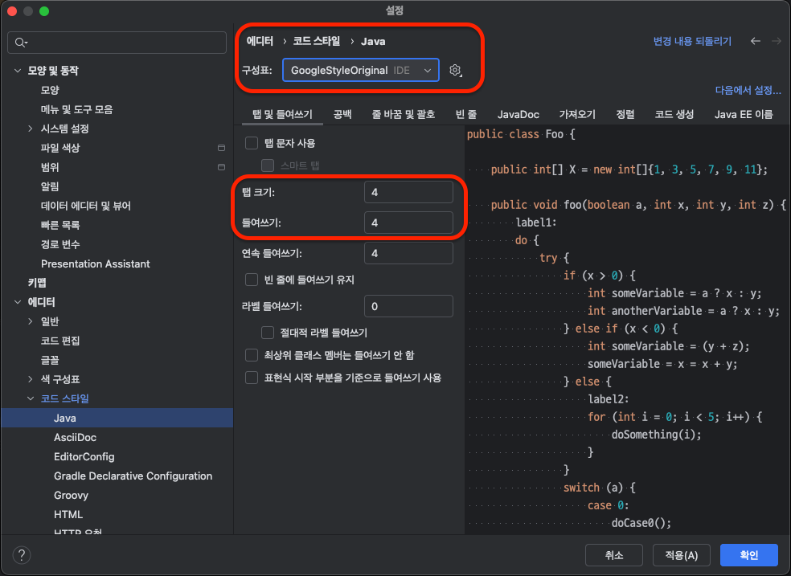
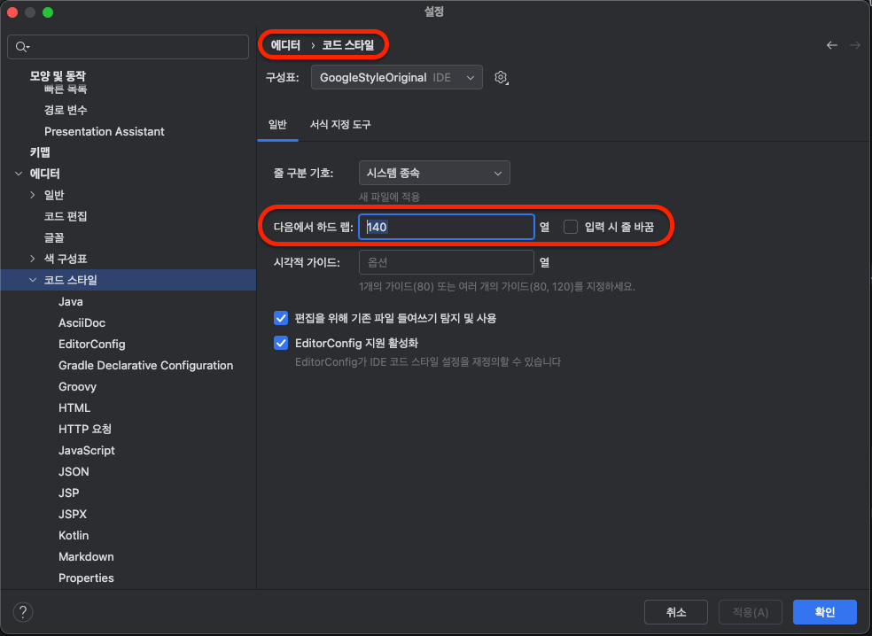
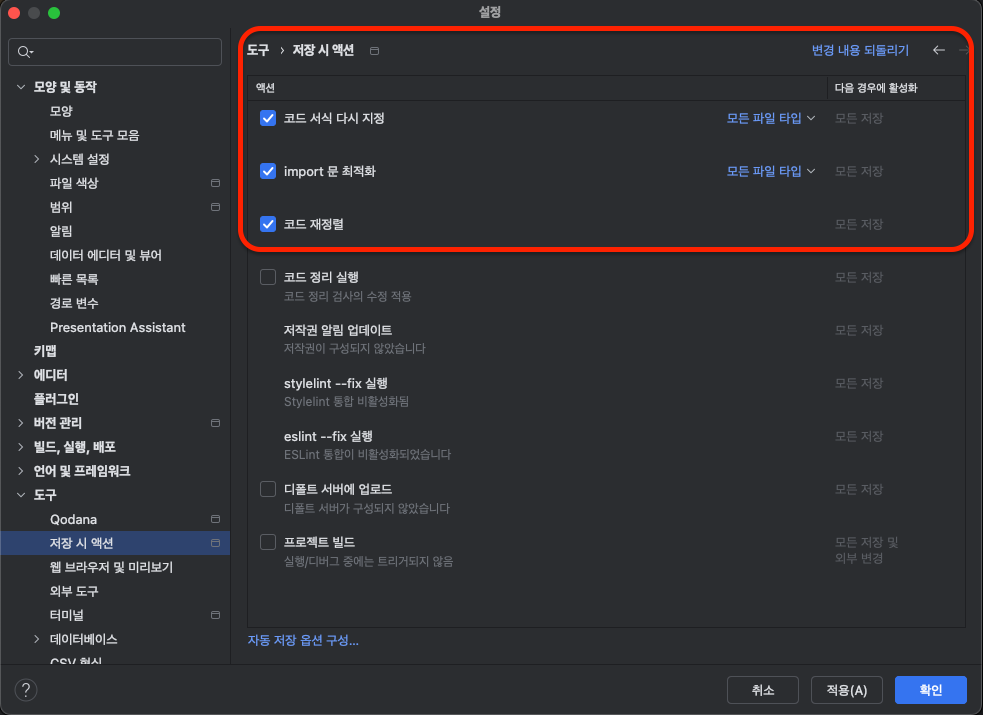

# 프로젝트 컨벤션

## 코드 스타일 가이드

1. [intellij-java-google-style.xml](./intellij-java-google-style.xml) 다운로드 ([출처](https://google.github.io/styleguide/javaguide.html))
2. 설정 -> 에디터 -> 코드 스타일 -> java -> 빨간 네모 속 구성표의 오른쪽 설정을 누르기
3. 구성표 가져오기 -> intellij idea 코드 스타일 xml 클릭 후 다운 받은 파일 선택
4. 탭 크기와 들여쓰기를 4로 맞춘 후 적용

1. 같은 설정에서 코드 스타일 탭으로 이동
2. 다음에서 하드 랩 140으로 설정 후 적용

1. 설정 -> 도구 -> 저장 시 액션 탭으로 이동
2. 위의 3개 선택 후 적용 