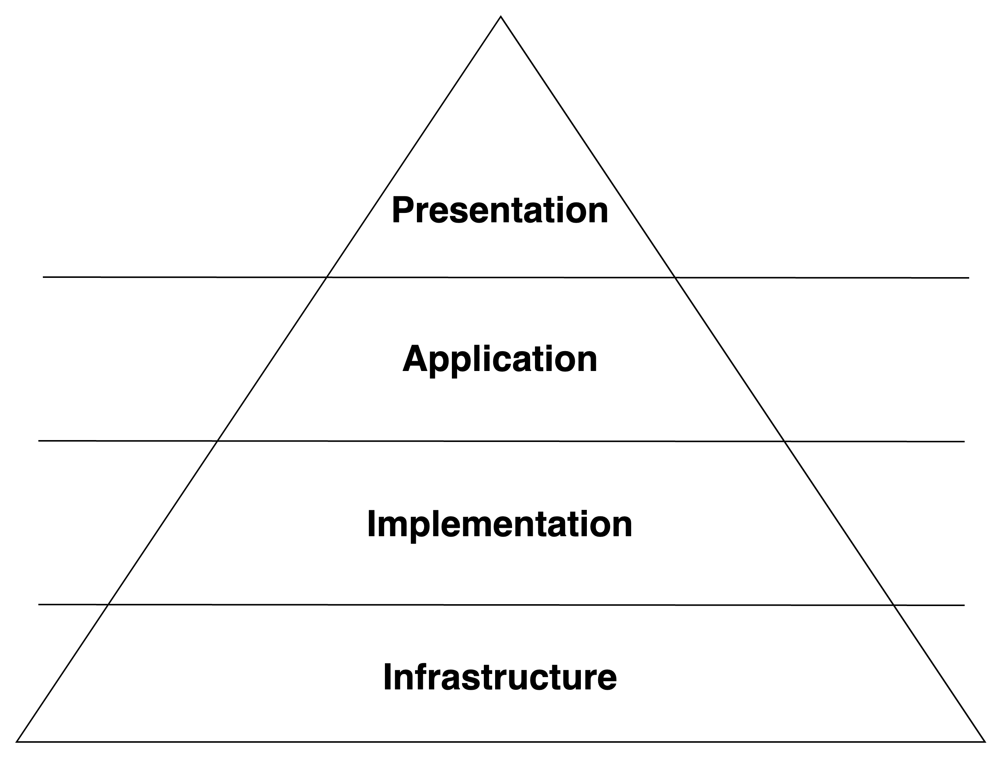

# 아키텍처 가이드

## 아키텍처 구성

### 1. Presentation Layer

- 외부와의 상호작용을 담당
- 컨트롤러 등 위치

### 2. Application Layer

- 비즈니스 로직을 기술
- 실제 구현보다는, 순서를 정하거나 트랜잭션 처리 등을 담당

### 3. Implementation Layer

- 비즈니스 규칙의 실제 구현을 담당

### 4. Infrastructure Layer

- 외부와 연결되는 인프라를 처리

---

## 원칙

### 1. 레이어는 위에서 아래로만 참조해야 함.

### 2. 레이어의 참조가 하위 레이어를 건너 뛰지 않아야 함.

### 3. 동일 레이어 간에는 서로 참조하지 않아야 함.

- Implementation Layer는 예외

---

## 예시

### 1. Presentation Layer

- SampleController, UserController 등

### 2. Application Layer

- SampleCreateService, SampleUpdateService, SampleQueryService, SampleCommandService 등
- SampleService은 지양하며, 구체적인 역할을 나누어 사용

### 3. Implementation Layer

- SampleReader, SampleSaver, SampleValidator 등

### 4. Infrastructure Layer

- SampleRepository 등

---

## 참고 자료

- [제미니 블로그](https://geminikims.medium.com/%EC%A7%80%EC%86%8D-%EC%84%B1%EC%9E%A5-%EA%B0%80%EB%8A%A5%ED%95%9C-%EC%86%8C%ED%94%84%ED%8A%B8%EC%9B%A8%EC%96%B4%EB%A5%BC-%EB%A7%8C%EB%93%A4%EC%96%B4%EA%B0%80%EB%8A%94-%EB%B0%A9%EB%B2%95-97844c5dab63)
- [제미니 유튜브](https://youtu.be/pimYIfXCUe8?si=uq8gNVo3SXolWdSf)